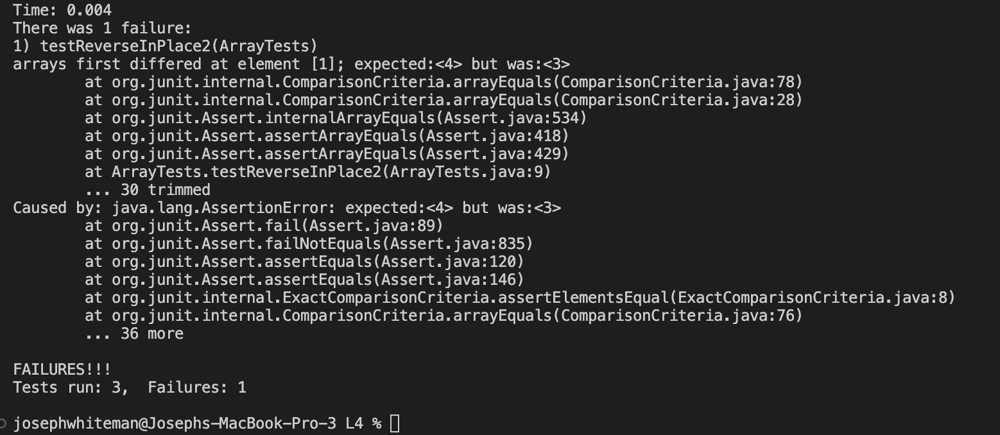
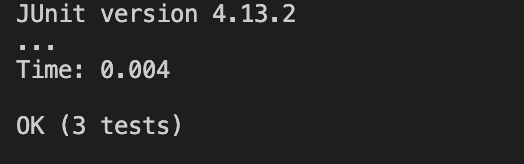

# Lab Report 3

## Part 1 - Bugs

In this blog post, we'll dissect a bug encountered in week 4's lab, focusing on array manipulation. We aim to highlight the debugging process through a failure-inducing input, a non-failure-inducing input, followed by the symptom, the original buggy code, the corrected code, and an explanation of the fix.

## A Failure-Inducing Input for the Buggy Program

This revised JUnit test introduces a scenario where the program fails due to incorrect array reversal logic when dealing with an even number of elements.

```java
@Test
public void testReverseInPlace2() {
    int[] input1 = { 4,3 };
    ArrayExamples.reverseInPlace(input1);
    assertArrayEquals(new int[]{ 3, 4 }, input1);
}
```
## An Input That Doesn't Induce a Failure

This updated test presents a scenario where the program functions correctly, dealing with an array containing an odd number of elements.

```java
@Test 
public void testReverseInPlace() {
    int[] input1 = { 3 };
    ArrayExamples.reverseInPlace(input1);
    assertArrayEquals(new int[]{ 3 }, input1);
}
```
## Symptom

The symptom of the bug is visually represented by the JUnit test output, which clearly indicates a failure in the testReverseInPlace2 method. The expected outcome does not match the actual result produced by the program under test.


## Debug

### Original Code:

The original implementation attempted to reverse the array in place but resulted in incorrect behavior due to overwriting elements before swapping them.

```java
static void reverseInPlace(int[] arr) {
  for(int i = 0; i < arr.length; i += 1) {
    arr[i] = arr[arr.length - i - 1];
  }
}
```
## New Code:

The corrected code fixes the bug by properly swapping elements from both ends towards the center, ensuring accurate reversal for arrays of any size.

```java
static void reverseInPlace(int[] arr) {
  for(int i = 0; i < arr.length / 2; i++) {
    int temp = arr[i];
    arr[i] = arr[arr.length - i - 1];
    arr[arr.length - i - 1] = temp;
  }
}
```
### Why the Fix Addresses the Issue

The updated code addresses the bug by incorporating a while loop that continues swapping elements until it reaches the center of the array. This method works correctly for arrays with both even and odd numbers of elements. The use of `left` and `right` indices ensures that each element is only swapped once, preventing the mistake in the original code where elements were being overwritten or not swapped correctly. This solution is robust, guaranteeing the accurate reversal of the array by iteratively moving inwards from both ends, thus rectifying the previous logic flaw.




# Part 2 - Researching Commands

For this task, we'll explore the `less` command, pivotal for viewing text files in Unix or Linux environments. The `less` command provides an interactive way to navigate text files, displaying portions of the text to make it easier to read through large files. Here are four interesting options for `less`, demonstrating its flexibility and utility:

## Option 1: `-N` (Line Numbers)
**Purpose**: Displays line numbers next to the text for easy reference.

- **Example 1**: 
  Command: `less -N ./technical/report.txt` 
  Output: Shows `report.txt` with line numbers, facilitating specific line references. *(Source: `man less`)*

- **Example 2**: 
  Command: `less -N ./technical/logs/system.log` 
  Output: Aids in troubleshooting by allowing easy reference to specific log entries. *(Source: `man less`)*

## Option 2: `-S` (Chop Long Lines)
**Purpose**: Prevents long lines from wrapping to the next line, preserving the original layout of wide content.

- **Example 1**: 
  Command: `less -S ./technical/configurations.cfg` 
  Output: Views configurations without line wrapping, keeping the layout intact. *(Source: `man less`)*

- **Example 2**: 
  Command: `less -S ./technical/data.csv` 
  Output: Maintains column alignment in CSV files by displaying lines without wrapping. *(Source: `man less`)*

## Option 3: `-i` (Ignore Case in Searches)
**Purpose**: Allows case-insensitive searches within the viewed file, enhancing search flexibility.

- **Example 1**: 
  Command: `less -i ./technical/documentation.md` 
  Output: Enables finding terms in the Markdown file regardless of case. *(Source: `man less`)*

- **Example 2**: 
  Command: `less -i ./technical/README` 
  Output: Improves keyword searching in README files by ignoring case differences. *(Source: `man less`)*

## Option 4: `-G` (Suppress Highlighting)
**Purpose**: Disables the highlighting of search matches, which can be useful in terminals where highlighting obscures text.

- **Example 1**: 
  Command: `less -G ./technical/specifications.txt` 
  Output: Improves readability by disabling search term highlighting. *(Source: `man less`)*

- **Example 2**: 
  Command: `less -G ./technical/notes.txt` 
  Output: Focuses on the text content by preventing distraction from highlighting. *(Source: `man less`)*

The `less` command, with its comprehensive set of options, stands as an essential tool for text file management and navigation. Each option (`-N`, `-S`, `-i`, `-G`) caters to specific needs, from enhancing readability to providing more efficient search capabilities. By leveraging these options, users can significantly improve their interaction with text files the command-line environment.

These examples and their explanations are based on functionalities documented within the Unix and Linux manual pages, specifically accessed via the `man less` command. This built-in manual system serves as the primary source of detailed and authoritative information on command-line tools in Unix-like operating systems, offering users a wealth of knowledge on the usage, options, and best practices for commands like `less`.
