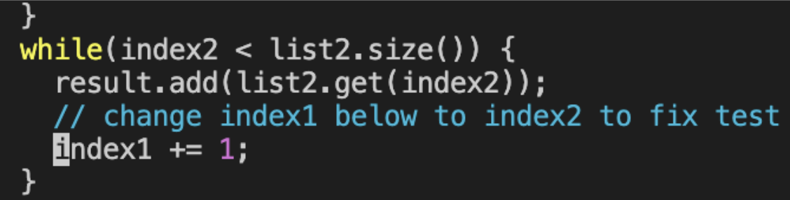

# Lab Report 4 - Mastering SSH, Vim, and Java Development Workflow

Throughout this lab, I utilized SSH for remote server access, edited files with Vim, and performed Java code compilation and testing. Detailed below is each step taken with the specific keys pressed to achieve the desired outcomes.

## Step 4: SSH into ieng6
Use SSH to connect to your ieng6-202 server. This is where you'll be performing your lab tasks. The jwhiteman part is your username on the ieng6 server, and ieng6-202.ucsd.edu is the address of the server.

**Command and Key Presses:**
```bash
ssh jwhiteman@ieng6-202.ucsd.edu
Pressed: s s h Space j w h i t e m a n @ i e n g 6 - 2 0 2 . u c s d . e d u <Enter>
```


This command securely connected me to the ieng6-202 server where I could begin my work.

## Step 5: Clone the GitHub Repository
After successfully logging into the ieng6 server, you'll clone the repository. This clones your fork of the lab7 repository to the ieng6 server. You're using the SSH protocol for cloning, which is secure and doesn't require you to enter your GitHub password thanks to the SSH key you've added to your GitHub account.

**Command and Key Presses:**
```bash
git clone git@github.com:JosephW23/lab7.git
Pressed: g i t Space c l o n e Space g i t @ g i t h u b . c o m : J o s e p h W 2 3 / l a b 7 . g i t <Enter>
```


The repository was then successfully cloned into my workspace.

## Step 6: Navigate to the Repository Directory
Once the repository is cloned, you need to change into the new directory that was created.

**Command and Key Presses:**
```bash
cd lab7/
Pressed: c d Space l a b 7 / <Enter>
```


Changes your current directory to the lab7 directory that contains your cloned repository.Now in the lab7 directory, I could manage and edit the project files.

## Step 7: Compile Java Tests
Compilation of the Java files was necessary to ensure everything was in order before running tests.

**Command and Key Presses:**
```bash
javac -cp .:lib/hamcrest-core-1.3.jar:lib/junit-4.13.2.jar *.java
Pressed: j a v a c Space - c p Space . : l i b / h a m c r e s t - c o r e - 1 . 3 . j a r : l i b / j u n i t - 4 . 1 3 . 2 . j a r Space * . j a v a <Enter>
```


Compiles your Java files, setting the classpath to include the necessary JUnit and Hamcrest libraries for the tests to run.The Java files compiled successfully, indicating no syntax errors were present.

## Step 8: Run Java Tests
Before fixing the code, I needed to run the unit tests to see the failure.



**Command and Key Presses:**
```bash
java -cp .:lib/hamcrest-core-1.3.jar:lib/junit-4.13.2.jar org.junit.runner.JUnitCore ListExamplesTests
Pressed: j a v a Space - c p Space . : l i b / h a m c r e s t - c o r e - 1 . 3 . j a r : l i b / j u n i t - 4 . 1 3 . 2 . j a r Space o r g . j u n i t . r u n n e r . J U n i t C o r e Space L i s t E x a m p l e s T e s t s <Enter>
```
Runs the test cases in ListExamplesTests. This step is crucial for identifying any failing tests that you'll need to fix.The tests ran and, as expected, one test failed. This confirmed the presence of an issue that I would address next.

## Step 9: Edit Code with Vim
Using Vim, I opened the file that required changes.

**Command and Key Presses:**
```bash
vim ListExamples.java
Pressed: v i m Space L i s t E x a m p l e s . j a v a <Enter>
```


Within Vim, I navigated to the problematic code segment and performed the necessary edits.


Key Presses in Vim:
```bash
:set number <Enter> to display line numbers for easier navigation.
: 4 4 G to jump to line 44.
i to switch to insert mode and make the code change.
<Esc> to return to normal mode after the changes.
:wq <Enter> to save the file and exit Vim.
Recompile and Rerun Tests
After editing the file, I recompiled and reran the tests to verify that the issues were resolved.
```

## Step 10: Run Fixed Java File Again
Repeat the compile and test commands to ensure your fixes have resolved the issues and all tests now pass.


Key Presses:
```bash
<Up> <Up> <Enter> to rerun the javac compilation command.
<Up> <Up> <Enter> to rerun the java test command.
```
## Step 11: Commit and Push Changes
Lastly, I committed the changes and pushed them to the GitHub repository.

Commands:

```bash
Copy code
git add .
git commit -m "Corrected index issue in merge function"
git push
Pressed: g i t Space a d d Space . <Enter> to stage the changes.
Pressed: g i t Space c o m m i t Space - m Space "Fixed the failing tests" <Enter> to commit the changes with a message.
Pressed: g i t Space p u s h <Enter> to push the changes to the remote repository.
```


## Conclusion
This process not only fixed the bug but also enhanced my familiarity with essential development tools like SSH, Vim, and Git.
Through these exercises, I've refined my ability to navigate and manipulate files on a remote server, leveraged Vim for quick edits, and solidified my understanding of Git operations.
